# Armazenamento do tráfego: performance com retenção integral

Data: 2026-09-29.

O MCP guarda header e body por inteiro, de qualquer tamanho, e as tools continuam respondendo rápido quando o volume é o de um checkout com centenas de produtos. O SQLite fica com as colunas curtas. O conteúdo grande fica em arquivo. O prazo apaga o ws inteiro. O padrão é 90 dias e o usuário muda esse número.

Fora desta spec: tool de grafo, índice vetorial e RAG. A descoberta da VM, a chave `vmUri` e o formato HAR 1.2 permanecem. Muda de onde o export lê o body.

## Modelo gravado

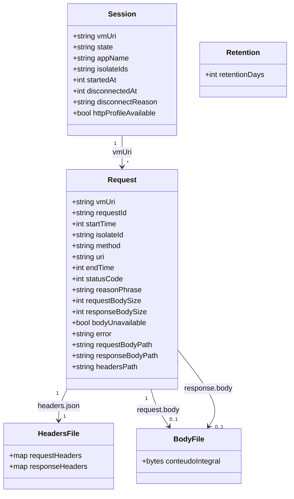

A pasta da sessão é `<dataDir>/bodies/<sha256 hex do vmUri canônico em UTF-8>/`.

O nome de cada arquivo, dentro dessa pasta, é `{startTime}_{sha256 hex do requestId em UTF-8}` com sufixo `.request.body`, `.response.body` ou `.headers.json`.

`headers.json` é um objeto com `requestHeaders` e `responseHeaders`. Os valores são string. Header vazio ainda gera o arquivo, com os dois mapas vazios.

Body entregue pela VM, inclusive com tamanho 0, gera arquivo. A linha guarda o path absoluto no processo do servidor e o tamanho. Body que a VM não entregou não gera arquivo: path nulo, `bodyUnavailable` verdadeiro.

Não há coluna de bytes, nem `raw_json`, nem corte em 1 MB. `requestBodyPath` e `responseBodyPath` ficam nulos quando o arquivo não existe. `headersPath` existe para toda request gravada.

Os paths devolvidos nas tools são os paths absolutos do processo do servidor. No container, isso é debaixo de `/data`, o volume do diretório de dados do host. O hash de 8 hex no nome do export continua sendo SHA-1 de `vmUri`, como hoje. A pasta `bodies/` usa SHA-256. São hashes diferentes de propósito.

## Gravação do poll

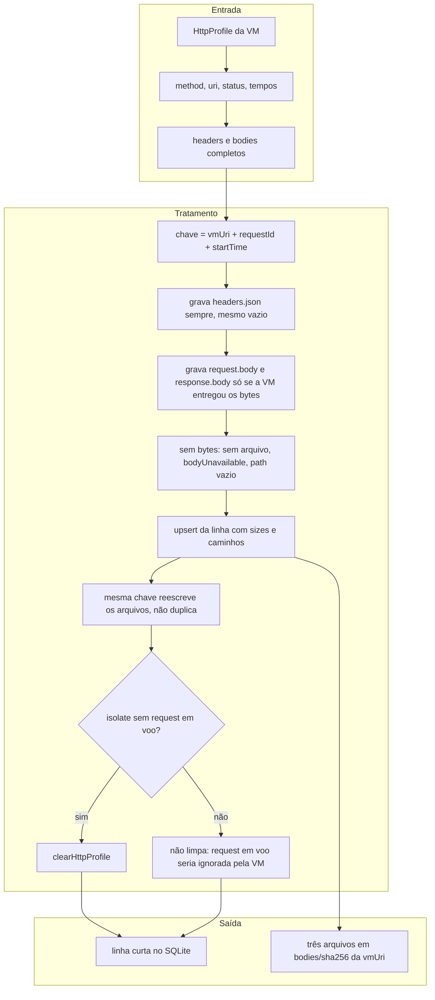

`clearHttpProfile` é por isolate, depois de persistir as requests já terminadas daquele poll. Se alguma request do perfil daquele isolate está sem `endTime`, o clear não roda.

`list_requests`, a varredura de TTL e a listagem de sessões não abrem arquivo de body nem de header.

## Retenção

Tabela `retention` com uma linha, coluna `days`, inserida com 90 na criação do banco.

`get_retention` não recebe argumento e devolve `{ "retentionDays": <days> }`.

`set_retention` recebe `days`. Inteiro menor que 1, ausente ou de outro tipo: `invalid_params`. Valor válido grava a linha e roda uma varredura na hora.

A varredura também roda na subida do processo e a cada 60 minutos. O relógio é injetável nos testes.

Sessão `live` não é apagada. Sessão `history` é apagada quando `disconnectedAt` não é nulo e a idade até o relógio é maior ou igual a `days`. A idade usa microssegundos. Junto saem as requests, a pasta `bodies/<sha256>/` e os exports cujo nome contém `_<8 hex SHA-1 de vmUri>.har` ou `.json`.

`disconnectedAt` nulo não é apagado pela varredura.

## Migração

Na abertura do banco, se existirem colunas de body, header ou `raw_json`, cada linha vira arquivos com os bytes e os mapas que já estão gravados. Em seguida a tabela `requests` é recriada no formato desta spec. Conteúdo que já tinha sido cortado em 1 MB continua cortado, porque esses bytes não estão mais no banco. A coluna de truncamento não permanece.

## Tools

`includeHistory=true` numa sessão `live` continua ignorado: a resposta fica `live` e só entra tráfego ao vivo. Sessão `history` sem a flag responde `history_requires_flag` e não inclui requests. Profiler HTTP indisponível responde `http_profile_unavailable` em `list_requests`, `get_request` e nos exports.

### attach_vm

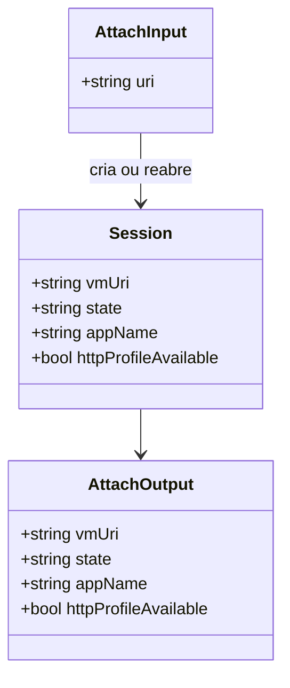

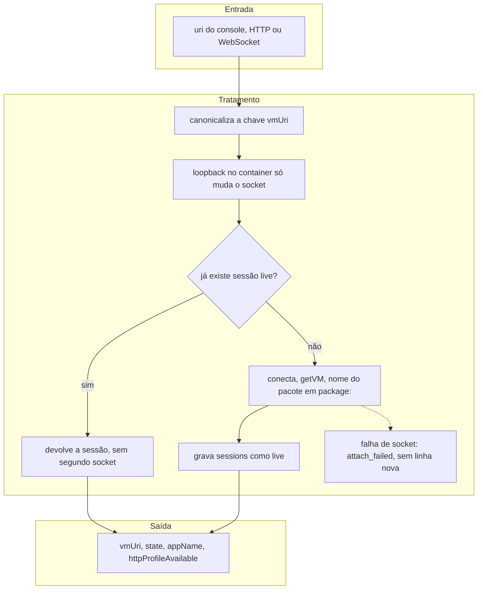

### list_sessions

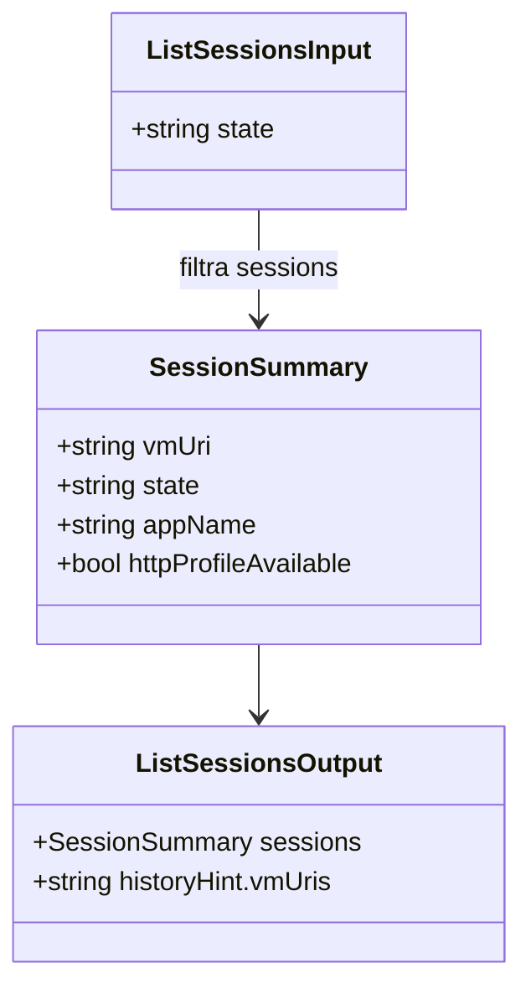

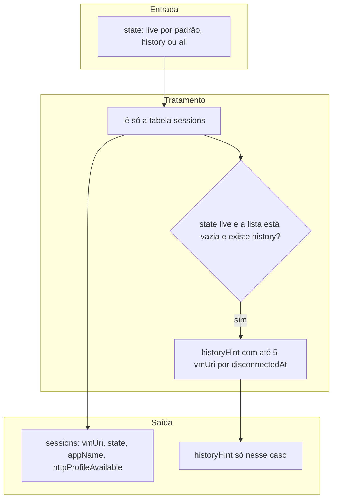

### get_session

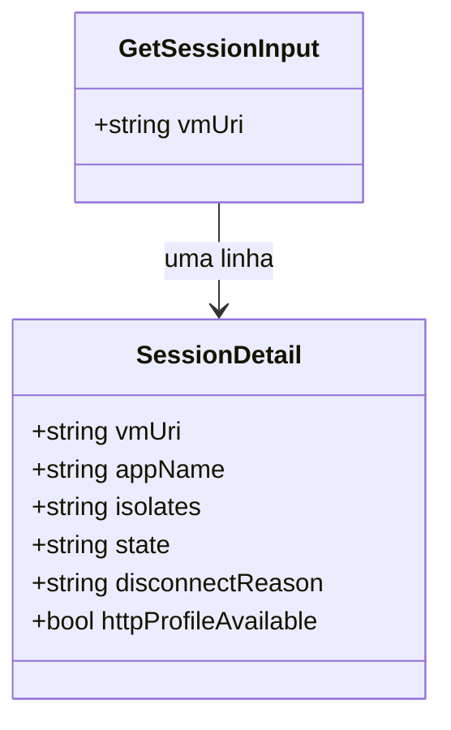

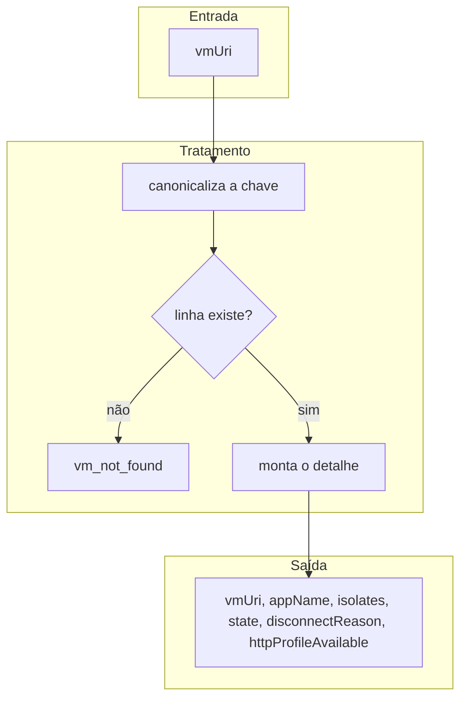

### list_requests

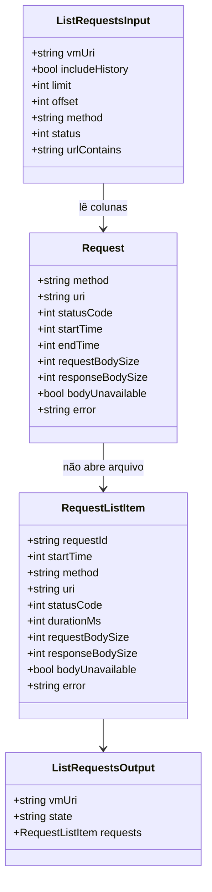

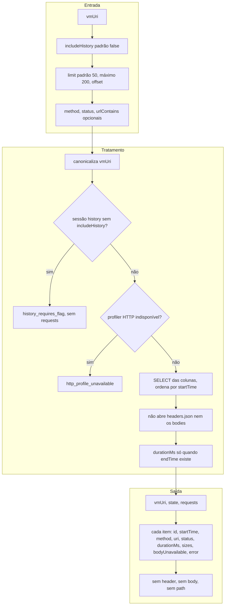

`requestBodySize`, `responseBodySize` e `bodyUnavailable` entram sempre. `requestBodySize` e `responseBodySize` usam 0 quando não há bytes. `durationMs` fica de fora quando não há `endTime`. `error` fica de fora quando é nulo.

### get_request

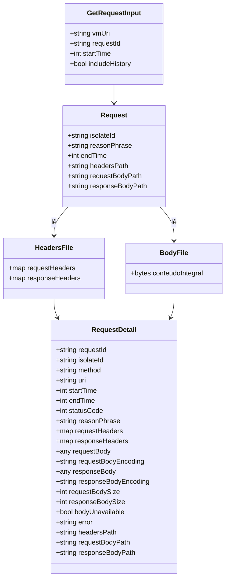

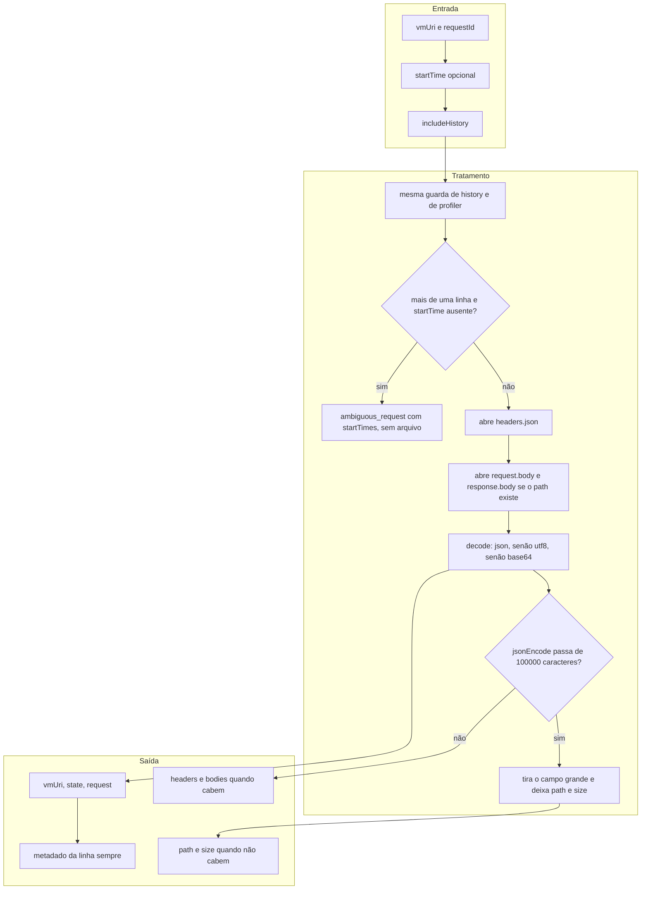

O limite é o comprimento de `jsonEncode` do objeto de sucesso. Enquanto passar de 100000 caracteres, omite nesta ordem: `responseBody` e `responseBodyEncoding`, depois `requestBody` e `requestBodyEncoding`, depois `requestHeaders` e `responseHeaders`. Cada omissão coloca o path daquele arquivo e tira o valor inline. Path de um campo só aparece quando esse campo foi omitido. Os sizes permanecem. O metadado da linha permanece. `ambiguous_request` não abre arquivo. O decode de body que cabe na resposta segue a regra atual: JSON, senão UTF-8, senão base64.

### export_har e export_devtools_json

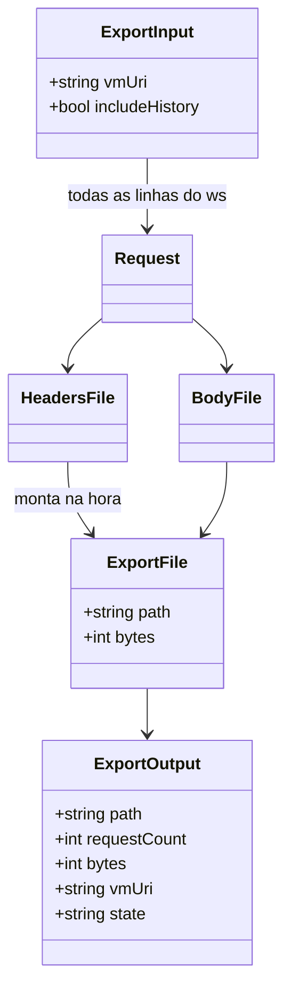

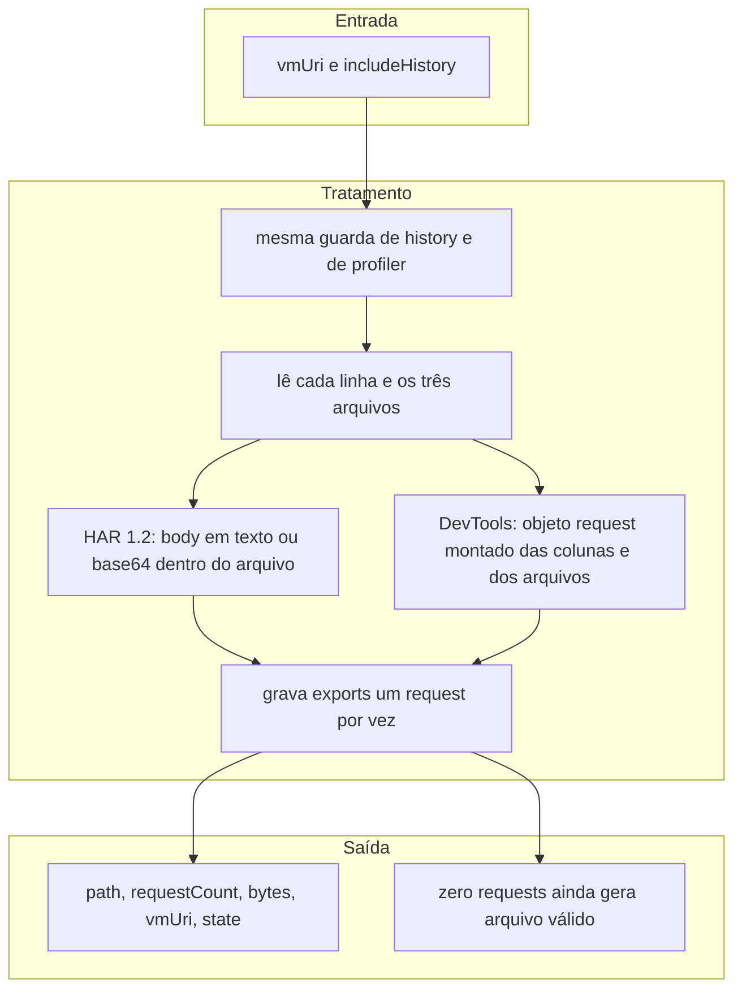

O arquivo de export é escrito request por request. O processo não acumula todos os bodies num único documento em memória. O nome do arquivo permanece `dart_network_mcp_<yyyyMMddTHHmmss>_<8 hex SHA-1>.har` ou `.json`.

### delete_session

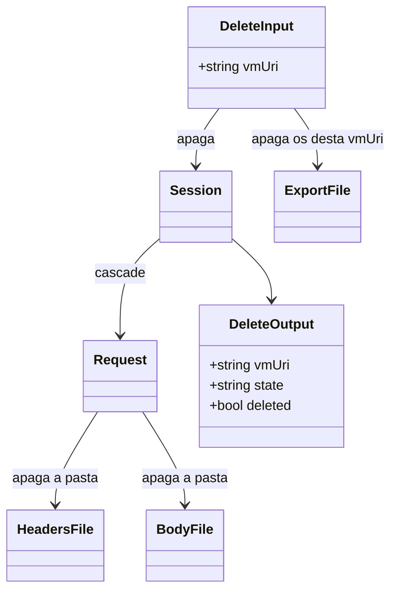

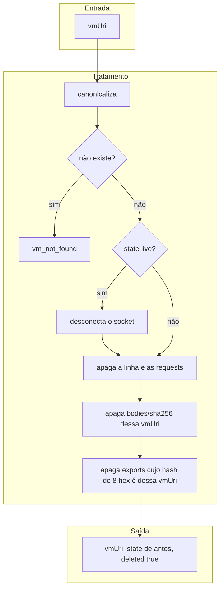

### get_retention e set_retention

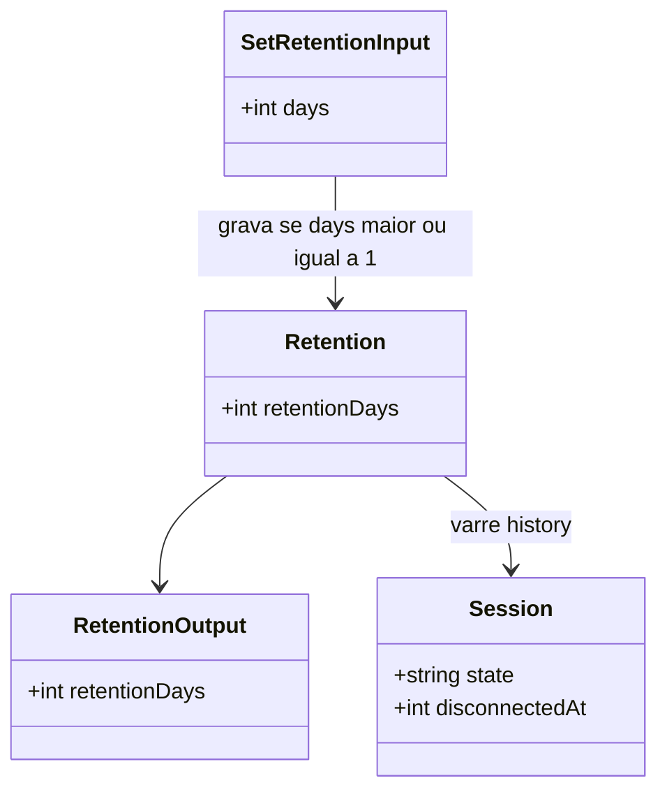

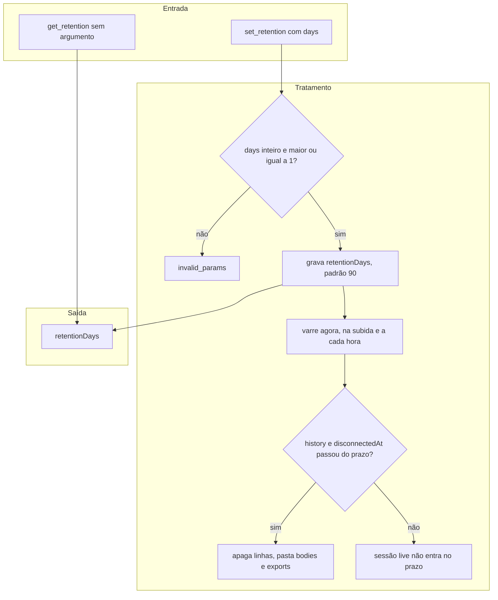

`get_retention` não dispara varredura. `set_retention` válido grava e varre uma vez.

## Testes

Caixa-preta, com relógio injetado na varredura.

- Body pequeno, body vazio e body maior que 1 MB vão para arquivo, inteiros. A linha não contém esses bytes e não tem `raw_json`.
- Header vazio gera `headers.json` com os dois mapas vazios. Body ausente não gera arquivo, marca `bodyUnavailable` e deixa o path nulo.
- A mesma chave reescreve os arquivos e permanece uma linha.
- `list_requests` devolve os sizes e não devolve header, body nem path. A implementação de leitura da listagem falha o teste se abrir arquivo de body ou de header.
- `get_request` devolve header e body decodificados quando o JSON cabe. Quando não cabe, omite na ordem definida e devolve path e size.
- `ambiguous_request` não abre arquivo.
- HAR e DevTools são montados das colunas e dos arquivos, com o body inteiro no export, sem juntar todos os bodies num único buffer.
- `delete_session` apaga linhas, a pasta `bodies/` daquele ws e os exports dele.
- `set_retention` com `days` menor que 1 responde `invalid_params`. Banco novo tem 90.
- Sessão `live` sobrevive ao TTL. Sessão `history` além do prazo perde linhas, pasta e exports. Dentro do prazo, fica.
- `clearHttpProfile` só ocorre sem request em voo. Com request em voo, o perfil fica e o término dela ainda é gravado.
- Migração: linha antiga com body na coluna vira arquivo e a coluna de bytes some.

## Documentação

`docs/mcp.md` passa a documentar cada tool com o diagrama de classes e o fluxo de entrada, tratamento e saída desta spec, no lugar de uma tabela única como descrição do armazenamento. O README acompanha as tools novas e o fato de `list_requests` não devolver body. O plano de implementação repete estes diagramas.
