# Guia de uso: dart-network-mcp

Servidor MCP que anexa em VMs Dart já em execução e expõe o tráfego HTTP do HTTP profile (`dart:io`). Cada sessão é uma chave: a URI WebSocket canônica da VM Service.

Use este servidor quando um agente precisa inspecionar requests/responses de um app Flutter ou Dart em debug — inclusive depois do crash, enquanto o log daquela URI ainda estiver no SQLite.

## Instalação

Na raiz do repositório:

```bash
bash install.sh --claude          # mescla em ~/.claude.json
bash install.sh --cursor          # mescla em ~/.cursor/mcp.json
bash install.sh --claude --cursor # os dois
```

Pelo menos uma flag é obrigatória. O script:

1. constrói a imagem `dart-network-mcp:local` (salvo `DART_NETWORK_MCP_INSTALL_SKIP_DOCKER=1`);
2. grava o catálogo e o profile Docker MCP `dart-network-mcp`;
3. mescla a entrada `dart-network-mcp` no cliente — **não** altera `MCP_DOCKER` nem outros servidores.

Entrada do cliente: o install aponta para `tool/run_mcp_container.sh`. O script remove os containers da imagem (incluindo os de nome aleatório e os da tag antiga `dart-vm-mcp:local`) e sobe um só, com `--name dart-network-mcp` e `--rm`.

```json
{
  "command": "<repo>/tool/run_mcp_container.sh",
  "args": []
}
```

O servidor é **long-lived**. O script faz `docker run -i` (não `docker mcp gateway`): no Docker Desktop o gateway costuma falhar ao usar `unix:///var/run/docker.sock`. Chamadas one-shot mal observam o poll de 1s do HTTP profile.

## Dados e privacidade

Diretório de dados:

| Prioridade | Caminho |
|---|---|
| 1 | `$DART_NETWORK_MCP_DATA` |
| 2 | `%LOCALAPPDATA%\dart-network-mcp` (se `LOCALAPPDATA` existir) |
| 3 | `~/.local/share/dart-network-mcp` |

No container: `DART_NETWORK_MCP_DATA=/data`. SQLite em `network.sqlite`; bodies e headers em `bodies/`; exports em `exports/`.

O SQLite guarda só metadados curtos. Headers e bodies completos (`Authorization`, cookies, etc.) ficam em arquivo. Trate o diretório de dados como credenciais. No Unix o diretório fica `0700` e o arquivo `0600`.

`delete_session` e a varredura de TTL apagam as linhas daquela sessão, a pasta `bodies/` correspondente e os exports cujo nome contém o hash de 8 hex SHA-1 da `vmUri`.

## Fluxo típico

```text
app em debug (imprime URI da VM)
        │
        ▼
list_sessions  ← ou attach_vm(uri) se a descoberta DTD não pegou
        │
        ▼
list_requests(vmUri)   → resumo + sizes (sem body, sem headers)
        │
        ▼
get_request(...)       → headers, isolate, sizes, body se couber no teto
        │
        ▼
export_har / export_devtools_json
```

1. Suba o app em debug (não-web se for usar o profiler `dart:io`).
2. A descoberta interna lê DTD / `~/.dart-tool` a cada 2s e anexa URIs novas. Se precisar, chame `attach_vm` com a URI do console (`http://…` ou `ws://…/ws`).
3. Consulte com `list_requests` / `get_request`.
4. Exporte HAR 1.2 ou o snapshot offline do DevTools.

Hot reload mantém a mesma `vmUri`. Hot restart na mesma VM mantém a chave e as linhas antigas; requests de abertura entram de novo com `startTime` novo.

Quando o app para, a sessão só vira `history` **depois que o socket da VM fecha** (Runner/DDS podem ficar ouvindo um tempo após o `stop` do `flutter run`).

## Sessões `live` e `history`

| Estado | Significado |
|---|---|
| `live` | Socket conectado; poll a cada 1s |
| `history` | Socket caiu; log permanece no SQLite |

- Tools de tráfego exigem `includeHistory=true` em sessão `history`. Sem a flag: `history_requires_flag` **sem** chave `requests`.
- `includeHistory=true` em sessão `live` é ignorado.
- `list_sessions` com default `live`, sem live e com history, inclui `historyHint.vmUris` (até 5, mais recentes primeiro).

## Tools

Todas as respostas de sucesso são JSON. Operações de sessão incluem `vmUri` e `state` quando aplicável. Erros: `{ "error": { "code", "message", "vmUri?" } }`.

O banco usa snake_case; o JSON das tools usa camelCase.

`includeHistory=true` numa sessão `live` continua ignorado: a resposta fica `live` e só entra tráfego ao vivo. Sessão `history` sem a flag responde `history_requires_flag` e não inclui requests. Profiler HTTP indisponível responde `http_profile_unavailable` em `list_requests`, `get_request` e nos exports.

### `list_sessions`

**Parâmetros:** `state` — `live` (default), `history` ou `all`.

```json
{
  "sessions": [
    {
      "vmUri": "ws://127.0.0.1:55530/tok=/ws",
      "state": "live",
      "appName": "dart_network_mcp_example",
      "httpProfileAvailable": true
    }
  ],
  "historyHint": { "vmUris": ["ws://…"] }
}
```

`historyHint` só aparece no default `live` quando a lista live está vazia e existe history.

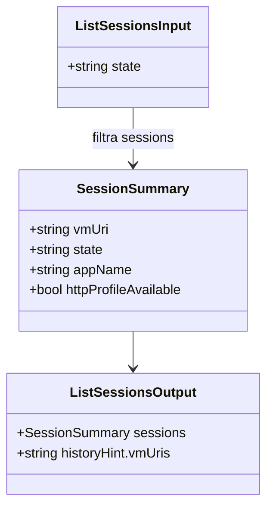

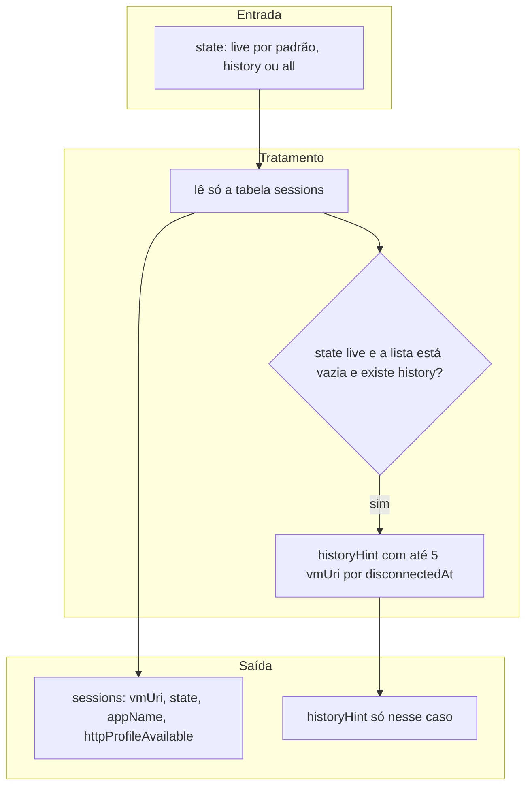

### `get_session`

**Parâmetros:** `vmUri`.

```json
{
  "vmUri": "ws://…",
  "appName": "dart_network_mcp_example",
  "isolates": ["isolates/…"],
  "state": "history",
  "disconnectReason": "socket closed",
  "httpProfileAvailable": true
}
```

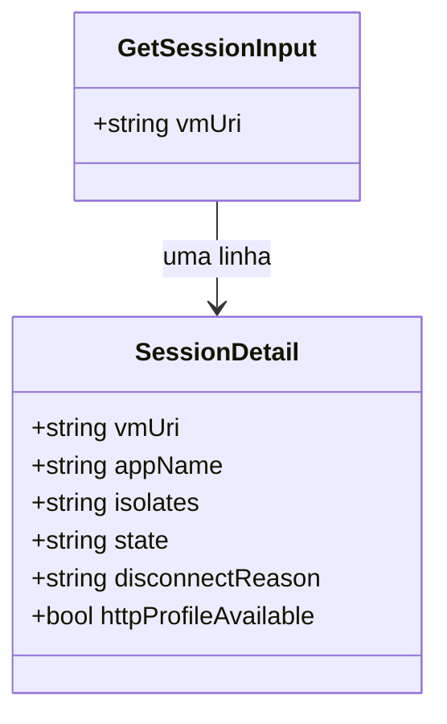

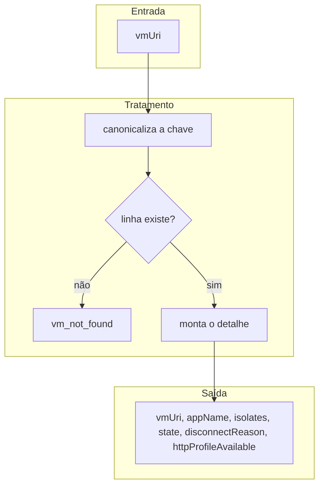

### `attach_vm`

**Parâmetros:** `uri` (HTTP ou WebSocket do console).

Sucesso:

```json
{
  "vmUri": "ws://127.0.0.1:55530/tok=/ws",
  "state": "live",
  "appName": "main",
  "httpProfileAvailable": true
}
```

- Sessão `live` já existente: devolve a sessão sem segundo socket.
- Sessão `history` cujo socket volta: passa a `live` e mantém as linhas.
- Falha de conexão: `attach_failed` (não cria linha).

Dentro do container, host loopback na URI vira `host.docker.internal` **só no socket**; a chave canônica continua com `127.0.0.1` / `localhost`.

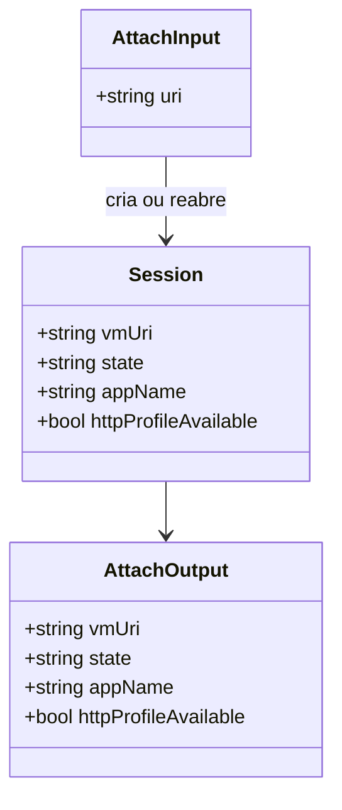

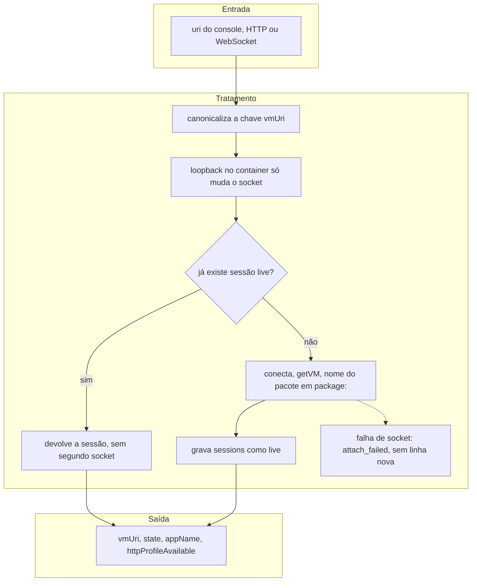

### `list_requests`

**Parâmetros:** `vmUri`, `includeHistory` (default `false`), `limit` (default 50, máx 200), `offset` (default 0), `method`, `status`, `urlContains`.

```json
{
  "vmUri": "ws://…",
  "state": "live",
  "requests": [
    {
      "requestId": "1",
      "startTime": 1790648106314927,
      "method": "GET",
      "uri": "https://jsonplaceholder.typicode.com/posts/1",
      "statusCode": 200,
      "durationMs": 120,
      "requestBodySize": 0,
      "responseBodySize": 292,
      "bodyUnavailable": false
    }
  ]
}
```

Não inclui headers, body nem path. A listagem não abre `headers.json` nem os arquivos de body. `requestBodySize`, `responseBodySize` e `bodyUnavailable` entram sempre; os sizes usam 0 quando não há bytes. `durationMs` fica de fora quando não há `endTime`. `error` fica de fora quando é nulo.

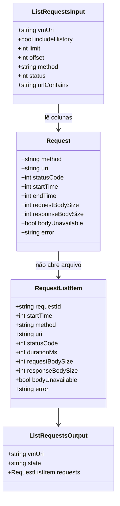

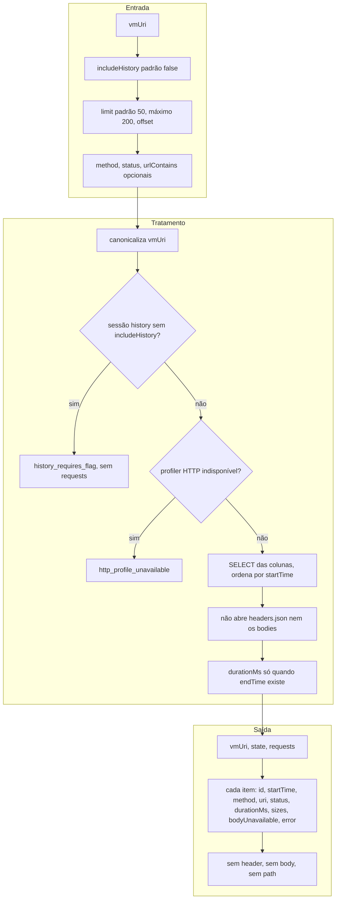

### `get_request`

**Parâmetros:** `vmUri`, `requestId`, `startTime` (opcional), `includeHistory`.

```json
{
  "vmUri": "ws://…",
  "state": "live",
  "request": {
    "requestId": "1",
    "isolateId": "isolates/…",
    "method": "GET",
    "uri": "https://…",
    "startTime": 1790648106314927,
    "endTime": 1790648106434927,
    "statusCode": 200,
    "reasonPhrase": "OK",
    "requestHeaders": {},
    "responseHeaders": {},
    "requestBodySize": 0,
    "responseBodySize": 292,
    "bodyUnavailable": false,
    "responseBody": { "id": 1 },
    "responseBodyEncoding": "json"
  }
}
```

Sem `startTime` e com mais de uma linha para o mesmo `requestId`: `ambiguous_request` com `error.startTimes`, sem abrir arquivo e sem bodies.

O teto da resposta de sucesso é **100000 caracteres** do `jsonEncode` do objeto. Enquanto passar desse comprimento, omite nesta ordem:

1. `responseBody` e `responseBodyEncoding`
2. `requestBody` e `requestBodyEncoding`
3. `requestHeaders` e `responseHeaders`

Cada omissão coloca o path daquele arquivo e tira o valor inline. Path de um campo só aparece quando esse campo foi omitido. Os sizes e o metadado da linha permanecem.

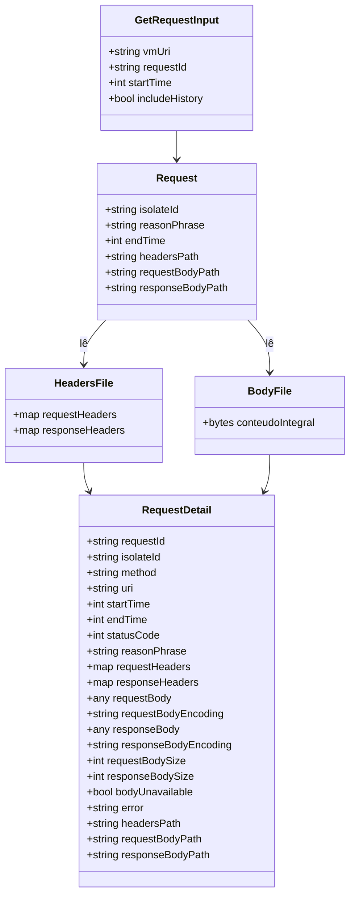

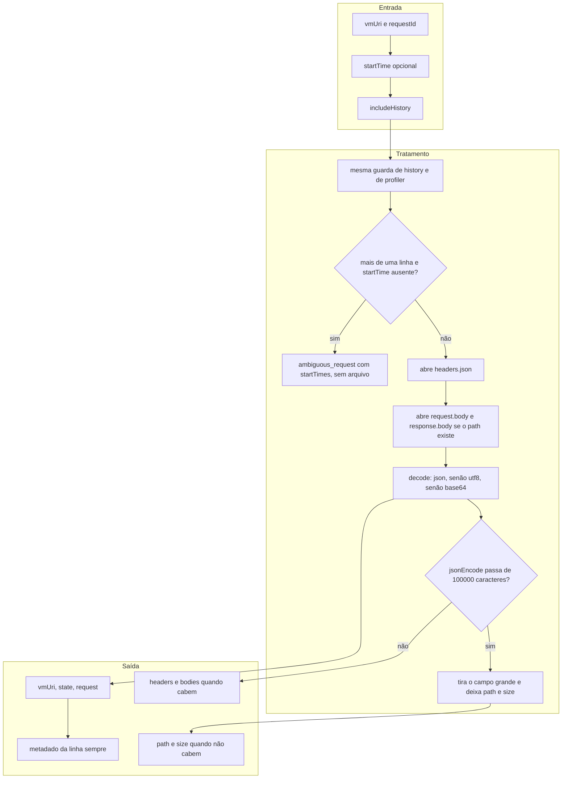

### `export_har` / `export_devtools_json`

**Parâmetros:** `vmUri`, `includeHistory`.

```json
{
  "path": "/data/exports/dart_network_mcp_20260929T021600_8ff87291.har",
  "requestCount": 217,
  "bytes": 48012,
  "vmUri": "ws://…",
  "state": "history"
}
```

Arquivo no host: `<dataDir>/exports/dart_network_mcp_<yyyyMMddTHHmmss>_<8 hex SHA-1 de vmUri>.har` ou `.json`. Timestamp local. Zero requests ainda gera arquivo válido. O arquivo é escrito request por request; o processo não acumula todos os bodies num único documento em memória.

No snapshot DevTools, `connectedApp.isFlutterApp` só é true com sessão **live** que registrue `ext.flutter.*`. Em history pura fica `false`.

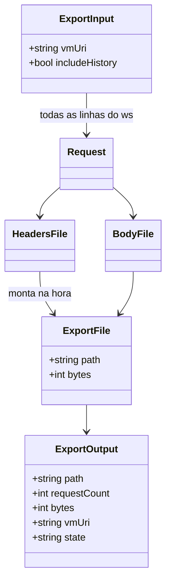

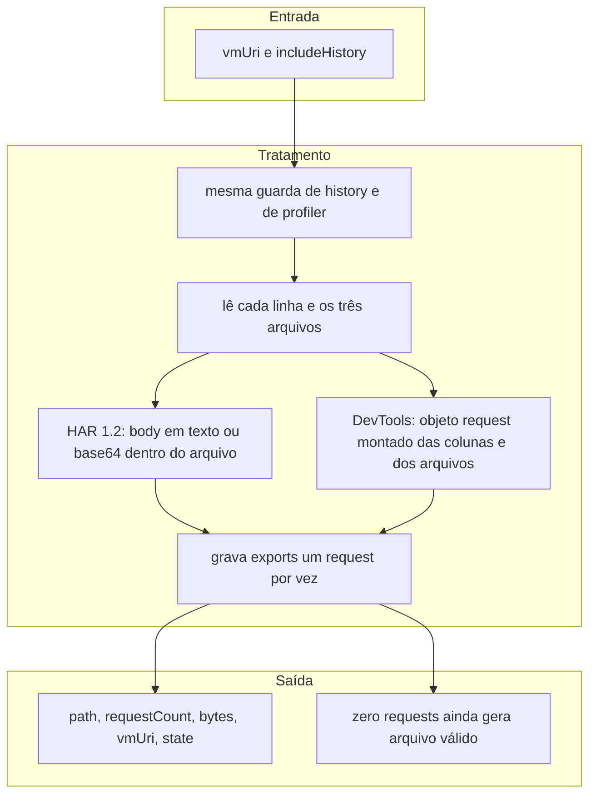

### `delete_session`

**Parâmetros:** `vmUri`.

```json
{
  "vmUri": "ws://…",
  "state": "history",
  "deleted": true
}
```

Desconecta se `live`, apaga a linha e o tráfego no SQLite, a pasta `bodies/` daquela `vmUri` e os exports dessa sessão (`_<8 hex SHA-1 de vmUri>.har` ou `.json`). A varredura de TTL faz o mesmo recorte para sessões `history` cujo `disconnectedAt` passou do prazo.

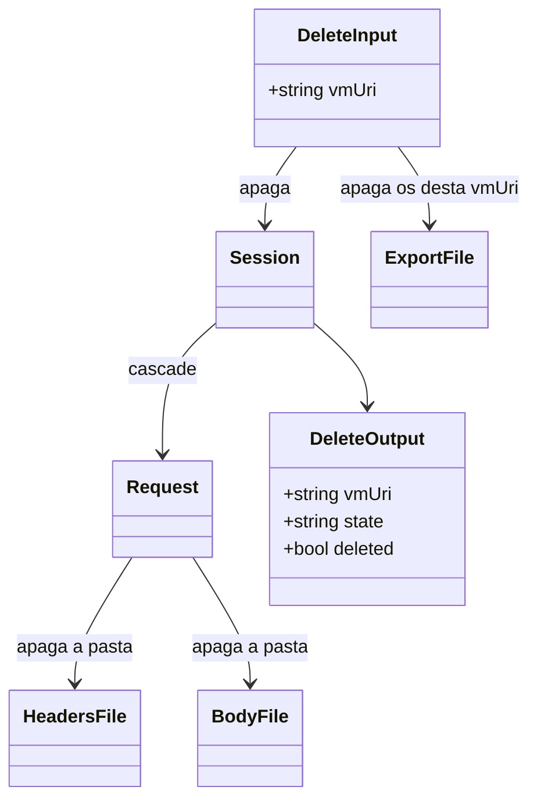

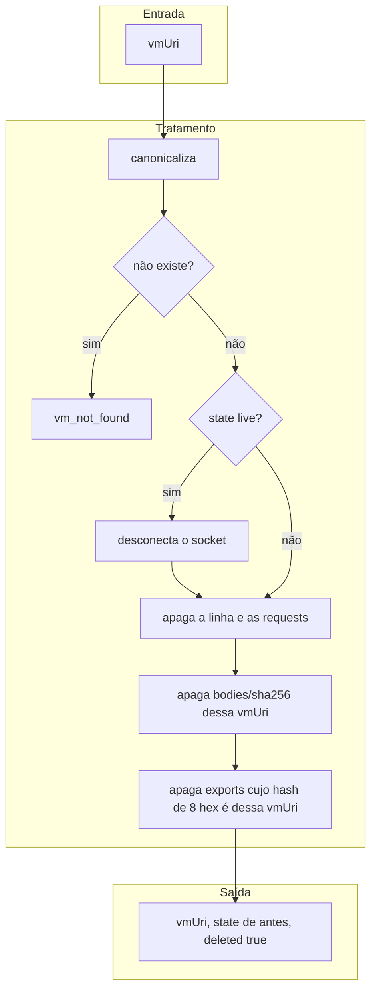

### `get_retention` / `set_retention`

**Parâmetros:** `get_retention` não recebe argumento. `set_retention` recebe `days` (inteiro ≥ 1).

```json
{ "retentionDays": 90 }
```

Banco novo usa 90 dias. `days` menor que 1, ausente ou de outro tipo: `invalid_params`. `get_retention` não dispara varredura. `set_retention` válido grava e varre uma vez. A varredura também roda na subida do processo e a cada 60 minutos.

Sessão `live` não é apagada. Sessão `history` é apagada quando `disconnectedAt` não é nulo e a idade até o relógio é maior ou igual a `days`. Junto saem as requests, a pasta `bodies/` e os exports daquela sessão.

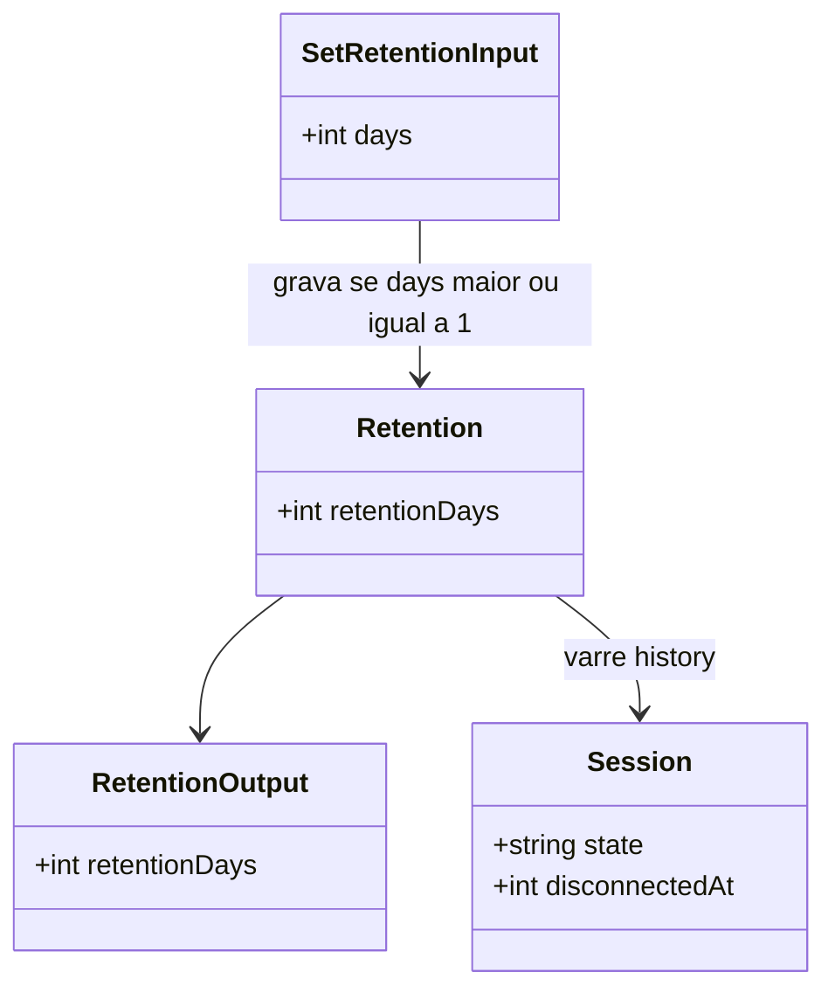

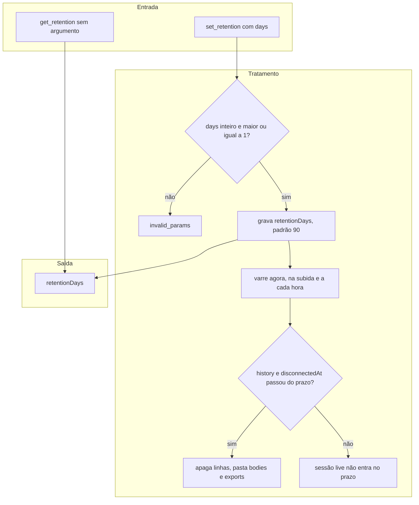

## Decode de body

Companions: `requestBodyEncoding` e `responseBodyEncoding`.

| Encoding | Quando |
|---|---|
| `json` | UTF-8 que `jsonDecode` aceita → valor JSON (objeto, array, número, bool, null) |
| `utf8` | Texto UTF-8 que não é JSON (inclui JSON truncado no meio) |
| `base64` | Bytes que não são UTF-8 válido |

Não há corte de body na gravação: o arquivo guarda os bytes inteiros. O teto de **100000 caracteres** aplica-se só ao JSON de `get_request`, com a ordem de omissão acima. HAR / DevTools JSON **não** usam esses companions: body fica texto ou base64 no formato do arquivo. O `dart:io` já entrega body descomprimido — não há gunzip extra.

## Erros

| `error.code` | Situação |
|---|---|
| `vm_not_found` | `vmUri` desconhecida |
| `request_not_found` | request ausente |
| `ambiguous_request` | vários `startTime` sem parâmetro |
| `attach_failed` | socket não conectou |
| `history_requires_flag` | sessão `history` sem `includeHistory` |
| `http_profile_unavailable` | VM sem profiler `dart:io` (ex.: alguns alvos web) |
| `sqlite_busy` | lock SQLite após `busy_timeout` 5s |
| `invalid_params` | argumento inválido/ausente no entrypoint stdio |

## App exemplo

```bash
cd example
flutter devices
flutter run -d <id>   # iOS, Android ou desktop — não web para o profiler
```

- `main` liga `HttpClient.enableTimelineLogging` **antes** do `runApp`.
- Abertura: `GET /posts/1`, `/users/1`, `/albums/1` em paralelo contra `https://jsonplaceholder.typicode.com`.
- A cada 5s: lote `POST`/`PUT`/`PATCH` ou `DELETE` + dois GETs.
- Pausar na UI segura o lote seguinte.

Copie a URI impressa, use `attach_vm` se necessário, e confira com `list_requests`.

## Referências

- Overview: [README.md](../README.md)
- Design / contrato: [.docs/superpowers/specs/2026-09-28-dart-vm-network-mcp-design.md](../.docs/superpowers/specs/2026-09-28-dart-vm-network-mcp-design.md)
- Armazenamento e tools: [.docs/superpowers/specs/2026-09-29-traffic-storage-performance-design.md](../.docs/superpowers/specs/2026-09-29-traffic-storage-performance-design.md)
